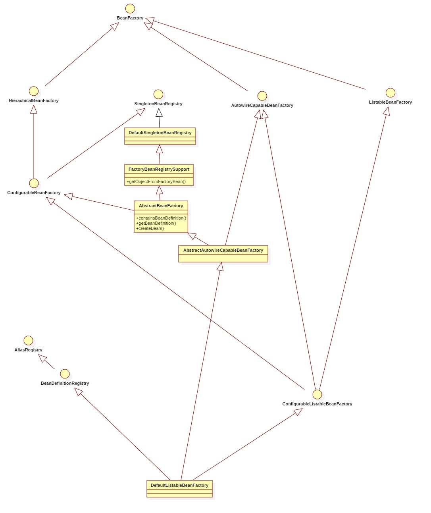

## BeanFactory 继承体系

---

BeanFactory是Spring框架最核心的接口，它提供了高级IOC的配置机制。BeanFactory使用管理不同类型的java对象成为可能，应用上下文ApplicationContext建立在BeanFactory基础之上，提供了更多面向应用功能，它提供了国际化支持及框架事件体系，更易于创建实际的应用。一般称BeanFactory为Ioc容器，而ApplicationContext为应用上下文。

- BeanFactory的继承体系如下图所示：

- BeanFactory继承体系中重要的Bean说明

   - BeanFactory
   
     > 定义：
   
         * The root interface for accessing a Spring bean container.
         * This is the basic client view of a bean container;
         * further interfaces such as {@link ListableBeanFactory} and
         * {@link org.springframework.beans.factory.config.ConfigurableBeanFactory}
         * are available for specific purposes.
         
     > 主要方法：
     
      - Object getBean(String name) throws BeansException
      - ...
      - <T> ObjectProvider<T> getBeanProvider(Class<T> requiredType)
      - ...
      - boolean containsBean(String name);
      - boolean isSingleton(String name) throws NoSuchBeanDefinitionException
      - boolean isPrototype(String name) throws NoSuchBeanDefinitionException
      - boolean isTypeMatch(String name, ResolvableType typeToMatch) throws NoSuchBeanDefinitionException
      - boolean isTypeMatch(String name, Class<?> typeToMatch) throws NoSuchBeanDefinitionException
      - Class<?> getType(String name) throws NoSuchBeanDefinitionException
      - String[] getAliases(String name)
     
   - HierarchicalBeanFactory
     > 定义
    
          * Sub-interface implemented by bean factories that can be part
          * of a hierarchy.
          *
          * 
The corresponding {@code setParentBeanFactory} method for bean
          * factories that allow setting the parent in a configurable
          * fashion can be found in the ConfigurableBeanFactory interface. 
     > 主要方法：
     - BeanFactory getParentBeanFactory()
     - boolean containsLocalBean(String name)          
   
   - AutowireCapableBeanFactory
     >定义：
     
         * Extension of the {@link org.springframework.beans.factory.BeanFactory}
         * interface to be implemented by bean factories that are capable of
         * autowiring, provided that they want to expose this functionality for
         * existing bean instances.  
         
     >主要方法：
     - <T> T createBean(Class<T> beanClass) throws BeansException
     - void autowireBean(Object existingBean) throws BeansException
         